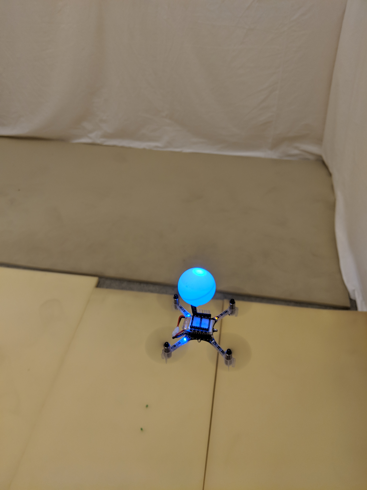

# EKF_firmware_forCrazyflieQuadcopter
Firmware for model-based nonlinear state estimation on the Crazyflie 2.0 platform
as part of my bachelor thesis: "Implementation of model-based nonlinear state estimation algorithms on quadcopters"
Under the supervision of: Prof. Dr. Rudibert King and Karl Neuhaeuser at the Chair of Measurement and Control Theory of the Technical University Berlin
Modified firmware for Crazyflie 2.0, Matlab Simulation (for model validation) and report can be found in the corresponding folders.

## Abstract
With the Crazyflie 2.0 quadcopter a low-cost platform for autonomous flying has been built. State estimation is done using the onboard sensors (IMU) and an external stereo-camera system for position measuring. Both measurements are fused with a model-based prediction using the Extended Kalman Filter algorithm. The quadcopter is controlled by exploiting a linearized decoupled system of the quadcopter. A cascaded controller is used for each subsystem.
Through an UI, which is run on a ground station, the user can input a desired position.
The system is now used for teaching fundamentals of control theory to undergraduate students.

## Impressions

